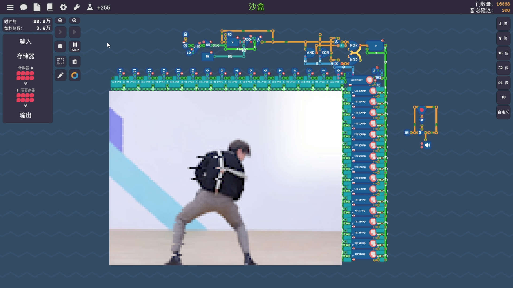
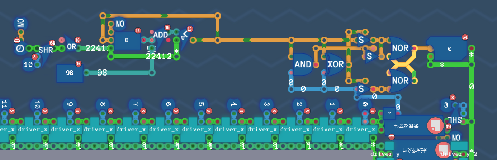
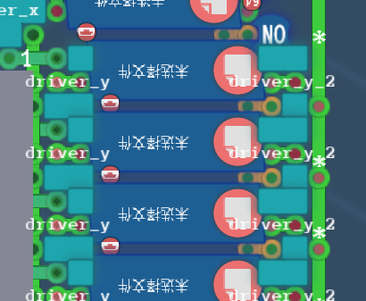
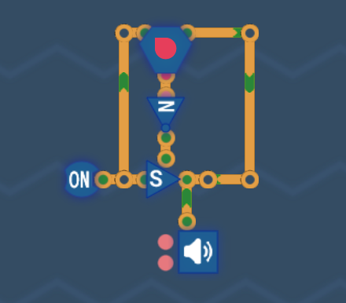
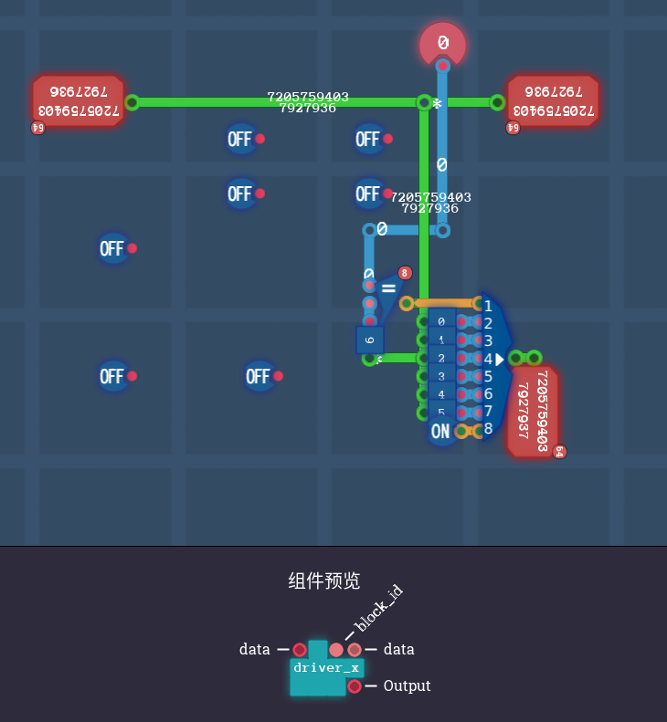
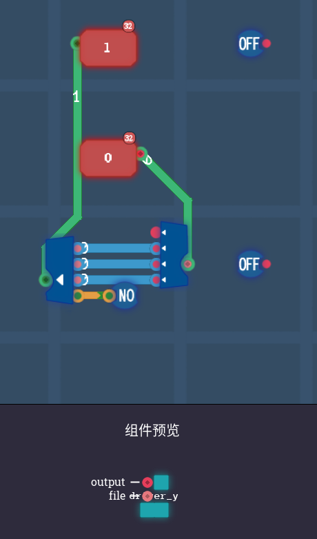
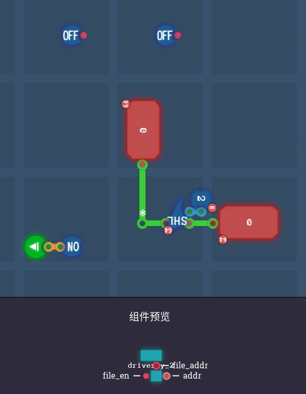

# TuringComplete-VideoPlayer
在游戏《图灵完备》中播放视频

## 存档使用

将saved/architecture/lcd目录复制到游戏存档/schematies/architecture目录下
将saved/component_factory/lcd目录复制到游戏存档/schematies/component_factory目录下

## 程序使用

先使用pr等视频工具，将源视频处理成128*96分辨率，修改帧率（不要太高），然后输出成图片序列

然后在代码中配置视频总帧数，修改读图片的路径，再执行程序

程序会生成16个data文件和一个address文件，将这些文件配置进存档的文件读取器，第一个文件读取器输入address文件，其它按顺序配置

如果帧率有修改，需要配置时间同步模块。方法是修改上面一个默认值是98的16位常量模块。值应该为976.5625/帧率，四舍五入取整

如果要播放bgm，可以导出成ogg格式，配置到右面的音频播放模块的0号源

## 存档模块截图

不复制存档的话，也可以选择手动照着下面的图搓一下

